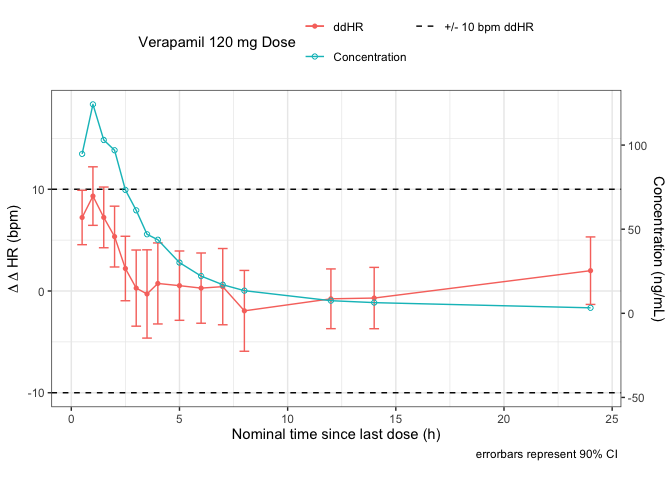
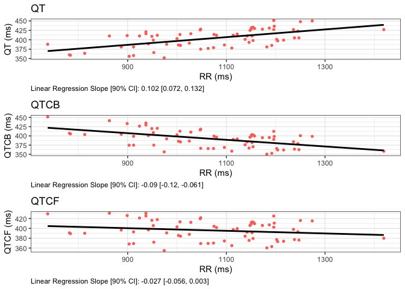
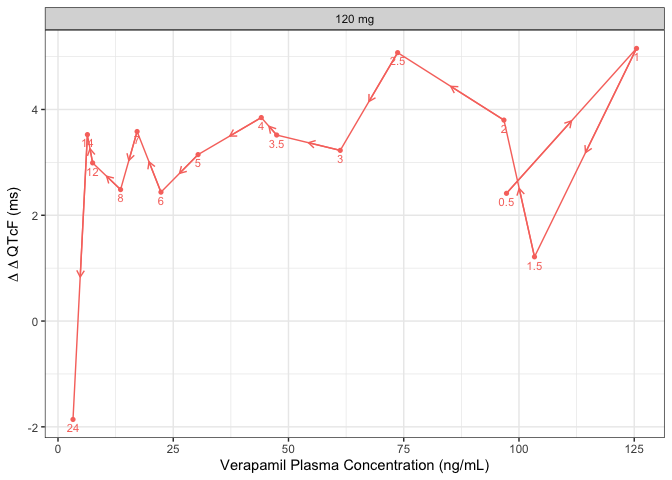
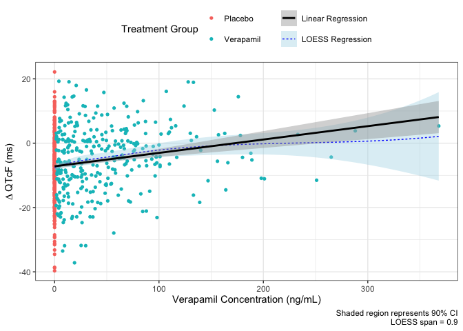
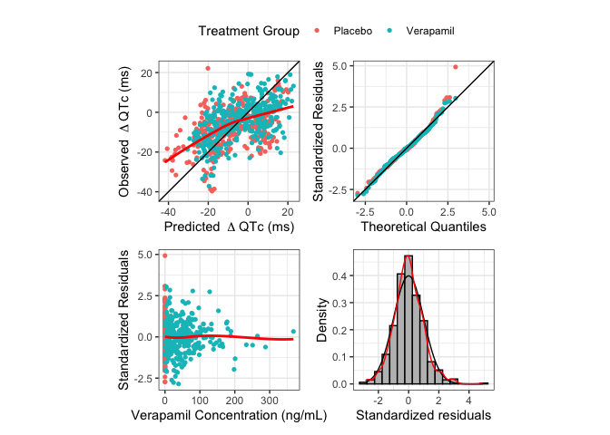
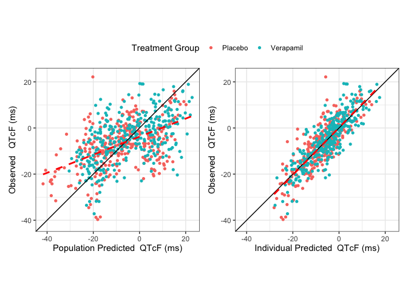
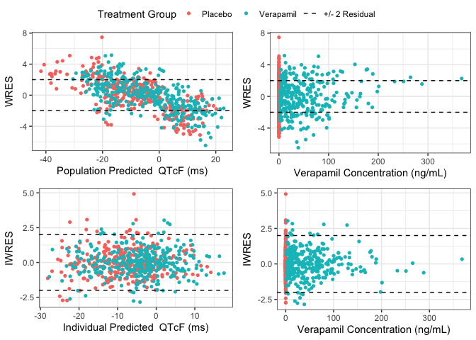
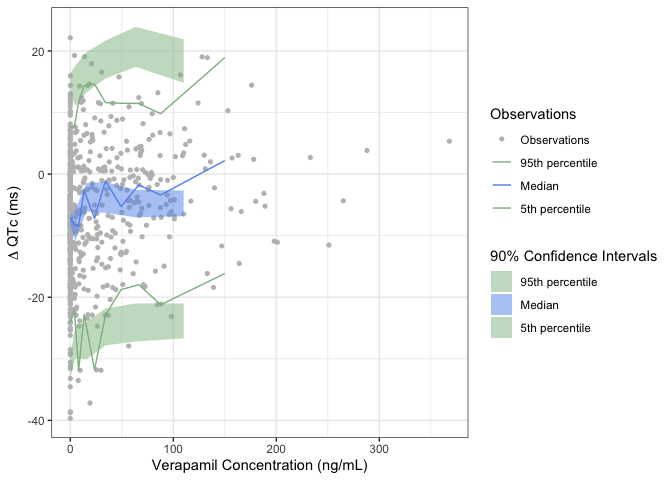
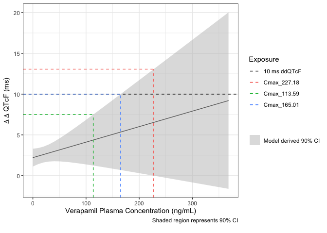

<!-- README.md is generated from README.Rmd. Please edit that file -->

# `cqtkit` 

<!-- badges: start -->

[](https://github.com/a2-ai-gilead-collab/cqtkit/actions/workflows/R-CMD-check.yaml)
<!-- badges: end -->

`cqtkit` makes C-QTc analysis straightforward — enabling users to
explore data, validate key assumptions from the white paper, fit and
assess the pre-specified model with comprehensive goodness-of-fit plots,
and generate relevant exposure–response predictions.

## Installation

You can install the development version of `cqtkit` from
[GitHub](https://github.com) with:

``` r
pak::pkg_install("a2-ai/cqtkit")
```

## Documentation

The documentation site for cqtkit can be found
[here](https://a2-ai.github.io/cqtkit-docs).

``` r
library(cqtkit)
library(ggstylekit)
library(dplyr)
library(gt)
```

## Preprocessing of C-QT datasets

`cqtkit` provides preprocessing functions to help compute derived ECG
parameters during data assembly. `preprocess(data, bl_data, by)` takes
an analysis-grain dataset plus a separate dataset of baseline ECG
measurements and adds:

- the population baseline means: HRBLM, QTCBBLM, QTCFBLM
- the baseline-from-mean deltas: deltaHRBL, deltaQTCBBL, deltaQTCFBL
- the row-level deltas: deltaQT, deltaRR, deltaHR, deltaQTCB, deltaQTCF

`data` must already carry the heart-rate-corrected columns (HR/HRBL,
QTCB/QTCBBL, QTCF/QTCFBL), since those corrections are nonlinear in RR
and should be computed per raw ECG replicate before averaging. See
`compute_qtcb_qtcf()`, `compute_hr()`, and the “Data Assembly” vignette.

The included `cqtkit_data_<drug>` datasets ship fully preprocessed, so
to show what `preprocess()` adds we drop the derived columns and rebuild
them from the matching `cqtkit_data_bl_<drug>` baseline dataset:

``` r
data_raw <- cqtkit_data_verapamil |>
  select(-HRBLM, -QTCBBLM, -QTCFBLM, -starts_with("delta"))

data_proc <- data_raw |>
  preprocess(cqtkit_data_bl_verapamil, by = c(ID, TRTG))

cat(paste(setdiff(names(data_proc), names(data_raw)), collapse = ", "), "\n")
#> HRBLM, QTCBBLM, QTCFBLM, deltaHRBL, deltaQTCBBL, deltaQTCFBL, deltaQTCB, deltaQTCF, deltaRR, deltaHR, deltaQT
```

## Exploratory Data Analysis with cqtkit

`cqtkit` provides extensive EDA functions for C-QT datasets to validate
key assumptions from the [Scientific White Paper on concentration-QTc
modeling](https://pubmed.ncbi.nlm.nih.gov/29209907/).

### Drug Effect on Heart Rate

``` r
eda_mean_dv_over_time(
  data = data_proc,
  dv_col = deltaHR,
  ntime_col = NTLD,
  dosef_col = DOSEF,
  reference_dose = "0 mg",
  reference_threshold = c(-10, 10),
  secondary_data_col = CONC,
  group_col = TRTG,
  conf_int = 0.9,
  style = style_spec(
    ylabel = bquote(Delta ~ Delta ~ "HR (bpm)"),
    legend.position = "top",
    legend.title.position = "left",
    legend_nrow = 2,
    legends = legend_spec(
      channel = "color",
      title = "Verapamil 120 mg Dose",
      labels = c(
        "120 mg Verapamil HCL deltaHR" = "ddHR",
        "120 mg Verapamil HCL CONC" = "Concentration",
        "Reference -10" = "+/- 10 bpm ddHR",
        "Reference 10" = NA
      )
    )
  )
)
```



### QTc Correction

``` r
bl <- cqtkit_data_bl_verapamil |> compute_qtcb_qtcf(qtbl_col = NULL, rrbl_col = NULL)
eda_qtc_comparison_plot(
  data = bl,
  rr_col = RR,
  qt_col = QT,
  qtcb_col = QTCB,
  qtcf_col = QTCF,
  style = style_spec(
    caption_hjust = "left"
  )
)
```



### Hysteresis

``` r
eda_hysteresis_loop_plot(
  data_proc,
  NTLD,
  deltaQTCF,
  CONC,
  DOSEF,
  reference_dose = "0 mg",
  style = style_spec(
    ylabel = bquote(Delta ~ Delta ~ "QTcF (ms)"),
    xlabel = "Verapamil Plasma Concentration (ng/mL)",
    legend.position = "none"
  )
)
```



### Linearity of Concentration-QTc Relationship

``` r
eda_scatter_with_regressions(
  data_proc,
  ydata_col = deltaQTCF,
  xdata_col = CONC,
  loess_line = TRUE,
  linear_line = TRUE,
  span = 0.90,
  trt_col = TRTG,
  style = style_spec(
    ylabel = bquote(Delta ~ "QTcF (ms)"),
    xlabel = "Verapamil Concentration (ng/mL)",
    legend.position = "top",
    legend.title.position = "left",
    legend_nrow = 2,
    legends = legend_spec(
      channel = "color",
      labels = c("Verapamil HCL" = "Verapamil")
    )
  )
)
```



## Modeling

`cqtkit` fits the prespecified linear mixed-effects model from the
Scientific White Paper using the `nlme` package.

``` r
dqtc_model <- fit_prespecified_model(
  data_proc,
  dv_col = deltaQTCF,
  id_col = ID,
  conc_col = CONC,
  delta_bl_col = deltaQTCFBL,
  trt_col = TRTG,
  tafd_col = TAFD,
  remove_conc_iiv = FALSE
)

tabulate_model_fit_parameters(
  dqtc_model,
  trt_col_name = "TRTG",
  tafd_col_name = "TAFD",
  conf_int = 0.9,
  decimals = 2,
  title = "Fixed-Effect Estimates for &Delta;QTcF Model"
) |>
  tab_source_note(
    source_note = "Additive Residual error model with IIV on intercept and slope"
  ) |>
  as_raw_html()
```

<div id="tbackvflea" style="padding-left:0px;padding-right:0px;padding-top:10px;padding-bottom:10px;overflow-x:auto;overflow-y:auto;width:auto;height:auto;">
  &#10;  <table class="gt_table" data-quarto-disable-processing="false" data-quarto-bootstrap="false" style="-webkit-font-smoothing: antialiased; -moz-osx-font-smoothing: grayscale; font-family: system-ui, 'Segoe UI', Roboto, Helvetica, Arial, sans-serif, 'Apple Color Emoji', 'Segoe UI Emoji', 'Segoe UI Symbol', 'Noto Color Emoji'; display: table; border-collapse: collapse; line-height: normal; margin-left: auto; margin-right: auto; color: #333333; font-size: 16px; font-weight: normal; font-style: normal; background-color: #FFFFFF; width: auto; border-top-style: solid; border-top-width: 2px; border-top-color: #A8A8A8; border-right-style: none; border-right-width: 2px; border-right-color: #D3D3D3; border-bottom-style: solid; border-bottom-width: 2px; border-bottom-color: #A8A8A8; border-left-style: none; border-left-width: 2px; border-left-color: #D3D3D3;" bgcolor="#FFFFFF">
  <thead style="border-style: none;">
    <tr class="gt_heading" style="border-style: none; background-color: #FFFFFF; text-align: center; border-bottom-color: #FFFFFF; border-left-style: none; border-left-width: 1px; border-left-color: #D3D3D3; border-right-style: none; border-right-width: 1px; border-right-color: #D3D3D3;" bgcolor="#FFFFFF" align="center">
      <td colspan="3" class="gt_heading gt_title gt_font_normal gt_bottom_border" style="border-style: none; color: #333333; font-size: 125%; padding-top: 4px; padding-bottom: 4px; padding-left: 5px; padding-right: 5px; background-color: #FFFFFF; text-align: center; border-left-style: none; border-left-width: 1px; border-left-color: #D3D3D3; border-right-style: none; border-right-width: 1px; border-right-color: #D3D3D3; border-bottom-style: solid; border-bottom-width: 2px; border-bottom-color: #D3D3D3; font-weight: normal;" bgcolor="#FFFFFF" align="center"><span class="gt_from_md">Fixed-Effect Estimates for ΔQTcF Model</span></td>
    </tr>
    &#10;    <tr class="gt_col_headings" style="border-style: none; border-top-style: solid; border-top-width: 2px; border-top-color: #D3D3D3; border-bottom-style: solid; border-bottom-width: 2px; border-bottom-color: #D3D3D3; border-left-style: none; border-left-width: 1px; border-left-color: #D3D3D3; border-right-style: none; border-right-width: 1px; border-right-color: #D3D3D3;">
      <th class="gt_col_heading gt_columns_bottom_border gt_left" rowspan="1" colspan="1" scope="col" id="Parameters" style="border-style: none; color: #333333; background-color: #FFFFFF; font-size: 100%; font-weight: normal; text-transform: inherit; border-left-style: none; border-left-width: 1px; border-left-color: #D3D3D3; border-right-style: none; border-right-width: 1px; border-right-color: #D3D3D3; vertical-align: bottom; padding-top: 5px; padding-bottom: 6px; padding-left: 5px; padding-right: 5px; overflow-x: hidden; text-align: left;" bgcolor="#FFFFFF" valign="bottom" align="left">Parameters</th>
      <th class="gt_col_heading gt_columns_bottom_border gt_right" rowspan="1" colspan="1" scope="col" id="Value" style="border-style: none; color: #333333; background-color: #FFFFFF; font-size: 100%; font-weight: normal; text-transform: inherit; border-left-style: none; border-left-width: 1px; border-left-color: #D3D3D3; border-right-style: none; border-right-width: 1px; border-right-color: #D3D3D3; vertical-align: bottom; padding-top: 5px; padding-bottom: 6px; padding-left: 5px; padding-right: 5px; overflow-x: hidden; text-align: right; font-variant-numeric: tabular-nums;" bgcolor="#FFFFFF" valign="bottom" align="right">Estimate [90% CI]</th>
      <th class="gt_col_heading gt_columns_bottom_border gt_right" rowspan="1" colspan="1" scope="col" id="p-value" style="border-style: none; color: #333333; background-color: #FFFFFF; font-size: 100%; font-weight: normal; text-transform: inherit; border-left-style: none; border-left-width: 1px; border-left-color: #D3D3D3; border-right-style: none; border-right-width: 1px; border-right-color: #D3D3D3; vertical-align: bottom; padding-top: 5px; padding-bottom: 6px; padding-left: 5px; padding-right: 5px; overflow-x: hidden; text-align: right; font-variant-numeric: tabular-nums;" bgcolor="#FFFFFF" valign="bottom" align="right">p-value</th>
    </tr>
  </thead>
  <tbody class="gt_table_body" style="border-style: none; border-top-style: solid; border-top-width: 2px; border-top-color: #D3D3D3; border-bottom-style: solid; border-bottom-width: 2px; border-bottom-color: #D3D3D3;">
    <tr class="gt_group_heading_row" style="border-style: none;">
      <th colspan="3" class="gt_group_heading" style="border-style: none; padding-top: 8px; padding-bottom: 8px; padding-left: 5px; padding-right: 5px; color: #333333; background-color: #FFFFFF; font-size: 100%; text-transform: inherit; border-top-style: solid; border-top-width: 2px; border-top-color: #D3D3D3; border-bottom-style: solid; border-bottom-width: 2px; border-bottom-color: #D3D3D3; border-left-style: none; border-left-width: 1px; border-left-color: #D3D3D3; border-right-style: none; border-right-width: 1px; border-right-color: #D3D3D3; vertical-align: middle; text-align: left; font-weight: bold;" scope="colgroup" id="Slope" bgcolor="#FFFFFF" valign="middle" align="left">Slope</th>
    </tr>
    <tr class="gt_row_group_first" style="border-style: none;"><td headers="Slope  Parameters" class="gt_row gt_left" style="border-style: none; padding-top: 8px; padding-bottom: 8px; padding-left: 5px; padding-right: 5px; margin: 10px; border-top-style: solid; border-top-color: #D3D3D3; border-left-style: none; border-left-width: 1px; border-left-color: #D3D3D3; border-right-style: none; border-right-width: 1px; border-right-color: #D3D3D3; vertical-align: middle; overflow-x: hidden; text-align: left; border-top-width: 2px;" valign="middle" align="left">CONC</td>
<td headers="Slope  Value" class="gt_row gt_right" style="border-style: none; padding-top: 8px; padding-bottom: 8px; padding-left: 5px; padding-right: 5px; margin: 10px; border-top-style: solid; border-top-color: #D3D3D3; border-left-style: none; border-left-width: 1px; border-left-color: #D3D3D3; border-right-style: none; border-right-width: 1px; border-right-color: #D3D3D3; vertical-align: middle; overflow-x: hidden; text-align: right; font-variant-numeric: tabular-nums; border-top-width: 2px;" valign="middle" align="right">1.97&nbsp;×&nbsp;10<sup style="font-size: 65%;">−2</sup> [−1.14&nbsp;×&nbsp;10<sup style="font-size: 65%;">−2</sup>, 5.08&nbsp;×&nbsp;10<sup style="font-size: 65%;">−2</sup>]</td>
<td headers="Slope  p-value" class="gt_row gt_right" style="border-style: none; padding-top: 8px; padding-bottom: 8px; padding-left: 5px; padding-right: 5px; margin: 10px; border-top-style: solid; border-top-color: #D3D3D3; border-left-style: none; border-left-width: 1px; border-left-color: #D3D3D3; border-right-style: none; border-right-width: 1px; border-right-color: #D3D3D3; vertical-align: middle; overflow-x: hidden; text-align: right; font-variant-numeric: tabular-nums; border-top-width: 2px;" valign="middle" align="right">2.98&nbsp;×&nbsp;10<sup style="font-size: 65%;">−1</sup></td></tr>
    <tr class="gt_group_heading_row" style="border-style: none;">
      <th colspan="3" class="gt_group_heading" style="border-style: none; padding-top: 8px; padding-bottom: 8px; padding-left: 5px; padding-right: 5px; color: #333333; background-color: #FFFFFF; font-size: 100%; text-transform: inherit; border-top-style: solid; border-top-width: 2px; border-top-color: #D3D3D3; border-bottom-style: solid; border-bottom-width: 2px; border-bottom-color: #D3D3D3; border-left-style: none; border-left-width: 1px; border-left-color: #D3D3D3; border-right-style: none; border-right-width: 1px; border-right-color: #D3D3D3; vertical-align: middle; text-align: left; font-weight: bold;" scope="colgroup" id="Treatment" bgcolor="#FFFFFF" valign="middle" align="left">Treatment</th>
    </tr>
    <tr class="gt_row_group_first" style="border-style: none;"><td headers="Treatment  Parameters" class="gt_row gt_left" style="border-style: none; padding-top: 8px; padding-bottom: 8px; padding-left: 5px; padding-right: 5px; margin: 10px; border-top-style: solid; border-top-color: #D3D3D3; border-left-style: none; border-left-width: 1px; border-left-color: #D3D3D3; border-right-style: none; border-right-width: 1px; border-right-color: #D3D3D3; vertical-align: middle; overflow-x: hidden; text-align: left; border-top-width: 2px;" valign="middle" align="left">Verapamil HCL</td>
<td headers="Treatment  Value" class="gt_row gt_right" style="border-style: none; padding-top: 8px; padding-bottom: 8px; padding-left: 5px; padding-right: 5px; margin: 10px; border-top-style: solid; border-top-color: #D3D3D3; border-left-style: none; border-left-width: 1px; border-left-color: #D3D3D3; border-right-style: none; border-right-width: 1px; border-right-color: #D3D3D3; vertical-align: middle; overflow-x: hidden; text-align: right; font-variant-numeric: tabular-nums; border-top-width: 2px;" valign="middle" align="right">2.16 [1.05, 3.27]</td>
<td headers="Treatment  p-value" class="gt_row gt_right" style="border-style: none; padding-top: 8px; padding-bottom: 8px; padding-left: 5px; padding-right: 5px; margin: 10px; border-top-style: solid; border-top-color: #D3D3D3; border-left-style: none; border-left-width: 1px; border-left-color: #D3D3D3; border-right-style: none; border-right-width: 1px; border-right-color: #D3D3D3; vertical-align: middle; overflow-x: hidden; text-align: right; font-variant-numeric: tabular-nums; border-top-width: 2px;" valign="middle" align="right">1.40&nbsp;×&nbsp;10<sup style="font-size: 65%;">−3</sup></td></tr>
    <tr class="gt_group_heading_row" style="border-style: none;">
      <th colspan="3" class="gt_group_heading" style="border-style: none; padding-top: 8px; padding-bottom: 8px; padding-left: 5px; padding-right: 5px; color: #333333; background-color: #FFFFFF; font-size: 100%; text-transform: inherit; border-top-style: solid; border-top-width: 2px; border-top-color: #D3D3D3; border-bottom-style: solid; border-bottom-width: 2px; border-bottom-color: #D3D3D3; border-left-style: none; border-left-width: 1px; border-left-color: #D3D3D3; border-right-style: none; border-right-width: 1px; border-right-color: #D3D3D3; vertical-align: middle; text-align: left; font-weight: bold;" scope="colgroup" id="Intercept" bgcolor="#FFFFFF" valign="middle" align="left">Intercept</th>
    </tr>
    <tr class="gt_row_group_first" style="border-style: none;"><td headers="Intercept  Parameters" class="gt_row gt_left" style="border-style: none; padding-top: 8px; padding-bottom: 8px; padding-left: 5px; padding-right: 5px; margin: 10px; border-top-style: solid; border-top-color: #D3D3D3; border-left-style: none; border-left-width: 1px; border-left-color: #D3D3D3; border-right-style: none; border-right-width: 1px; border-right-color: #D3D3D3; vertical-align: middle; overflow-x: hidden; text-align: left; border-top-width: 2px;" valign="middle" align="left">Intercept</td>
<td headers="Intercept  Value" class="gt_row gt_right" style="border-style: none; padding-top: 8px; padding-bottom: 8px; padding-left: 5px; padding-right: 5px; margin: 10px; border-top-style: solid; border-top-color: #D3D3D3; border-left-style: none; border-left-width: 1px; border-left-color: #D3D3D3; border-right-style: none; border-right-width: 1px; border-right-color: #D3D3D3; vertical-align: middle; overflow-x: hidden; text-align: right; font-variant-numeric: tabular-nums; border-top-width: 2px;" valign="middle" align="right">−8.92 [−1.30&nbsp;×&nbsp;10<sup style="font-size: 65%;">1</sup>, −4.85]</td>
<td headers="Intercept  p-value" class="gt_row gt_right" style="border-style: none; padding-top: 8px; padding-bottom: 8px; padding-left: 5px; padding-right: 5px; margin: 10px; border-top-style: solid; border-top-color: #D3D3D3; border-left-style: none; border-left-width: 1px; border-left-color: #D3D3D3; border-right-style: none; border-right-width: 1px; border-right-color: #D3D3D3; vertical-align: middle; overflow-x: hidden; text-align: right; font-variant-numeric: tabular-nums; border-top-width: 2px;" valign="middle" align="right">3.27&nbsp;×&nbsp;10<sup style="font-size: 65%;">−4</sup></td></tr>
    <tr style="border-style: none;"><td headers="Intercept  Parameters" class="gt_row gt_left" style="border-style: none; padding-top: 8px; padding-bottom: 8px; padding-left: 5px; padding-right: 5px; margin: 10px; border-top-style: solid; border-top-width: 1px; border-top-color: #D3D3D3; border-left-style: none; border-left-width: 1px; border-left-color: #D3D3D3; border-right-style: none; border-right-width: 1px; border-right-color: #D3D3D3; vertical-align: middle; overflow-x: hidden; text-align: left;" valign="middle" align="left">deltaQTCFBL</td>
<td headers="Intercept  Value" class="gt_row gt_right" style="border-style: none; padding-top: 8px; padding-bottom: 8px; padding-left: 5px; padding-right: 5px; margin: 10px; border-top-style: solid; border-top-width: 1px; border-top-color: #D3D3D3; border-left-style: none; border-left-width: 1px; border-left-color: #D3D3D3; border-right-style: none; border-right-width: 1px; border-right-color: #D3D3D3; vertical-align: middle; overflow-x: hidden; text-align: right; font-variant-numeric: tabular-nums;" valign="middle" align="right">−6.77&nbsp;×&nbsp;10<sup style="font-size: 65%;">−1</sup> [−7.49&nbsp;×&nbsp;10<sup style="font-size: 65%;">−1</sup>, −6.05&nbsp;×&nbsp;10<sup style="font-size: 65%;">−1</sup>]</td>
<td headers="Intercept  p-value" class="gt_row gt_right" style="border-style: none; padding-top: 8px; padding-bottom: 8px; padding-left: 5px; padding-right: 5px; margin: 10px; border-top-style: solid; border-top-width: 1px; border-top-color: #D3D3D3; border-left-style: none; border-left-width: 1px; border-left-color: #D3D3D3; border-right-style: none; border-right-width: 1px; border-right-color: #D3D3D3; vertical-align: middle; overflow-x: hidden; text-align: right; font-variant-numeric: tabular-nums;" valign="middle" align="right">4.36&nbsp;×&nbsp;10<sup style="font-size: 65%;">−46</sup></td></tr>
    <tr class="gt_group_heading_row" style="border-style: none;">
      <th colspan="3" class="gt_group_heading" style="border-style: none; padding-top: 8px; padding-bottom: 8px; padding-left: 5px; padding-right: 5px; color: #333333; background-color: #FFFFFF; font-size: 100%; text-transform: inherit; border-top-style: solid; border-top-width: 2px; border-top-color: #D3D3D3; border-bottom-style: solid; border-bottom-width: 2px; border-bottom-color: #D3D3D3; border-left-style: none; border-left-width: 1px; border-left-color: #D3D3D3; border-right-style: none; border-right-width: 1px; border-right-color: #D3D3D3; vertical-align: middle; text-align: left; font-weight: bold;" scope="colgroup" id="Time" bgcolor="#FFFFFF" valign="middle" align="left">Time</th>
    </tr>
    <tr class="gt_row_group_first" style="border-style: none;"><td headers="Time  Parameters" class="gt_row gt_left" style="border-style: none; padding-top: 8px; padding-bottom: 8px; padding-left: 5px; padding-right: 5px; margin: 10px; border-top-style: solid; border-top-color: #D3D3D3; border-left-style: none; border-left-width: 1px; border-left-color: #D3D3D3; border-right-style: none; border-right-width: 1px; border-right-color: #D3D3D3; vertical-align: middle; overflow-x: hidden; text-align: left; border-top-width: 2px;" valign="middle" align="left">1 HR</td>
<td headers="Time  Value" class="gt_row gt_right" style="border-style: none; padding-top: 8px; padding-bottom: 8px; padding-left: 5px; padding-right: 5px; margin: 10px; border-top-style: solid; border-top-color: #D3D3D3; border-left-style: none; border-left-width: 1px; border-left-color: #D3D3D3; border-right-style: none; border-right-width: 1px; border-right-color: #D3D3D3; vertical-align: middle; overflow-x: hidden; text-align: right; font-variant-numeric: tabular-nums; border-top-width: 2px;" valign="middle" align="right">3.94 [1.89, 5.99]</td>
<td headers="Time  p-value" class="gt_row gt_right" style="border-style: none; padding-top: 8px; padding-bottom: 8px; padding-left: 5px; padding-right: 5px; margin: 10px; border-top-style: solid; border-top-color: #D3D3D3; border-left-style: none; border-left-width: 1px; border-left-color: #D3D3D3; border-right-style: none; border-right-width: 1px; border-right-color: #D3D3D3; vertical-align: middle; overflow-x: hidden; text-align: right; font-variant-numeric: tabular-nums; border-top-width: 2px;" valign="middle" align="right">1.64&nbsp;×&nbsp;10<sup style="font-size: 65%;">−3</sup></td></tr>
    <tr style="border-style: none;"><td headers="Time  Parameters" class="gt_row gt_left" style="border-style: none; padding-top: 8px; padding-bottom: 8px; padding-left: 5px; padding-right: 5px; margin: 10px; border-top-style: solid; border-top-width: 1px; border-top-color: #D3D3D3; border-left-style: none; border-left-width: 1px; border-left-color: #D3D3D3; border-right-style: none; border-right-width: 1px; border-right-color: #D3D3D3; vertical-align: middle; overflow-x: hidden; text-align: left;" valign="middle" align="left">1.5 HR</td>
<td headers="Time  Value" class="gt_row gt_right" style="border-style: none; padding-top: 8px; padding-bottom: 8px; padding-left: 5px; padding-right: 5px; margin: 10px; border-top-style: solid; border-top-width: 1px; border-top-color: #D3D3D3; border-left-style: none; border-left-width: 1px; border-left-color: #D3D3D3; border-right-style: none; border-right-width: 1px; border-right-color: #D3D3D3; vertical-align: middle; overflow-x: hidden; text-align: right; font-variant-numeric: tabular-nums;" valign="middle" align="right">2.06 [3.01&nbsp;×&nbsp;10<sup style="font-size: 65%;">−2</sup>, 4.10]</td>
<td headers="Time  p-value" class="gt_row gt_right" style="border-style: none; padding-top: 8px; padding-bottom: 8px; padding-left: 5px; padding-right: 5px; margin: 10px; border-top-style: solid; border-top-width: 1px; border-top-color: #D3D3D3; border-left-style: none; border-left-width: 1px; border-left-color: #D3D3D3; border-right-style: none; border-right-width: 1px; border-right-color: #D3D3D3; vertical-align: middle; overflow-x: hidden; text-align: right; font-variant-numeric: tabular-nums;" valign="middle" align="right">9.51&nbsp;×&nbsp;10<sup style="font-size: 65%;">−2</sup></td></tr>
    <tr style="border-style: none;"><td headers="Time  Parameters" class="gt_row gt_left" style="border-style: none; padding-top: 8px; padding-bottom: 8px; padding-left: 5px; padding-right: 5px; margin: 10px; border-top-style: solid; border-top-width: 1px; border-top-color: #D3D3D3; border-left-style: none; border-left-width: 1px; border-left-color: #D3D3D3; border-right-style: none; border-right-width: 1px; border-right-color: #D3D3D3; vertical-align: middle; overflow-x: hidden; text-align: left;" valign="middle" align="left">2 HR</td>
<td headers="Time  Value" class="gt_row gt_right" style="border-style: none; padding-top: 8px; padding-bottom: 8px; padding-left: 5px; padding-right: 5px; margin: 10px; border-top-style: solid; border-top-width: 1px; border-top-color: #D3D3D3; border-left-style: none; border-left-width: 1px; border-left-color: #D3D3D3; border-right-style: none; border-right-width: 1px; border-right-color: #D3D3D3; vertical-align: middle; overflow-x: hidden; text-align: right; font-variant-numeric: tabular-nums;" valign="middle" align="right">6.49 [4.45, 8.52]</td>
<td headers="Time  p-value" class="gt_row gt_right" style="border-style: none; padding-top: 8px; padding-bottom: 8px; padding-left: 5px; padding-right: 5px; margin: 10px; border-top-style: solid; border-top-width: 1px; border-top-color: #D3D3D3; border-left-style: none; border-left-width: 1px; border-left-color: #D3D3D3; border-right-style: none; border-right-width: 1px; border-right-color: #D3D3D3; vertical-align: middle; overflow-x: hidden; text-align: right; font-variant-numeric: tabular-nums;" valign="middle" align="right">2.08&nbsp;×&nbsp;10<sup style="font-size: 65%;">−7</sup></td></tr>
    <tr style="border-style: none;"><td headers="Time  Parameters" class="gt_row gt_left" style="border-style: none; padding-top: 8px; padding-bottom: 8px; padding-left: 5px; padding-right: 5px; margin: 10px; border-top-style: solid; border-top-width: 1px; border-top-color: #D3D3D3; border-left-style: none; border-left-width: 1px; border-left-color: #D3D3D3; border-right-style: none; border-right-width: 1px; border-right-color: #D3D3D3; vertical-align: middle; overflow-x: hidden; text-align: left;" valign="middle" align="left">2.5 HR</td>
<td headers="Time  Value" class="gt_row gt_right" style="border-style: none; padding-top: 8px; padding-bottom: 8px; padding-left: 5px; padding-right: 5px; margin: 10px; border-top-style: solid; border-top-width: 1px; border-top-color: #D3D3D3; border-left-style: none; border-left-width: 1px; border-left-color: #D3D3D3; border-right-style: none; border-right-width: 1px; border-right-color: #D3D3D3; vertical-align: middle; overflow-x: hidden; text-align: right; font-variant-numeric: tabular-nums;" valign="middle" align="right">5.61 [3.57, 7.66]</td>
<td headers="Time  p-value" class="gt_row gt_right" style="border-style: none; padding-top: 8px; padding-bottom: 8px; padding-left: 5px; padding-right: 5px; margin: 10px; border-top-style: solid; border-top-width: 1px; border-top-color: #D3D3D3; border-left-style: none; border-left-width: 1px; border-left-color: #D3D3D3; border-right-style: none; border-right-width: 1px; border-right-color: #D3D3D3; vertical-align: middle; overflow-x: hidden; text-align: right; font-variant-numeric: tabular-nums;" valign="middle" align="right">7.43&nbsp;×&nbsp;10<sup style="font-size: 65%;">−6</sup></td></tr>
    <tr style="border-style: none;"><td headers="Time  Parameters" class="gt_row gt_left" style="border-style: none; padding-top: 8px; padding-bottom: 8px; padding-left: 5px; padding-right: 5px; margin: 10px; border-top-style: solid; border-top-width: 1px; border-top-color: #D3D3D3; border-left-style: none; border-left-width: 1px; border-left-color: #D3D3D3; border-right-style: none; border-right-width: 1px; border-right-color: #D3D3D3; vertical-align: middle; overflow-x: hidden; text-align: left;" valign="middle" align="left">3 HR</td>
<td headers="Time  Value" class="gt_row gt_right" style="border-style: none; padding-top: 8px; padding-bottom: 8px; padding-left: 5px; padding-right: 5px; margin: 10px; border-top-style: solid; border-top-width: 1px; border-top-color: #D3D3D3; border-left-style: none; border-left-width: 1px; border-left-color: #D3D3D3; border-right-style: none; border-right-width: 1px; border-right-color: #D3D3D3; vertical-align: middle; overflow-x: hidden; text-align: right; font-variant-numeric: tabular-nums;" valign="middle" align="right">3.12 [1.08, 5.16]</td>
<td headers="Time  p-value" class="gt_row gt_right" style="border-style: none; padding-top: 8px; padding-bottom: 8px; padding-left: 5px; padding-right: 5px; margin: 10px; border-top-style: solid; border-top-width: 1px; border-top-color: #D3D3D3; border-left-style: none; border-left-width: 1px; border-left-color: #D3D3D3; border-right-style: none; border-right-width: 1px; border-right-color: #D3D3D3; vertical-align: middle; overflow-x: hidden; text-align: right; font-variant-numeric: tabular-nums;" valign="middle" align="right">1.19&nbsp;×&nbsp;10<sup style="font-size: 65%;">−2</sup></td></tr>
    <tr style="border-style: none;"><td headers="Time  Parameters" class="gt_row gt_left" style="border-style: none; padding-top: 8px; padding-bottom: 8px; padding-left: 5px; padding-right: 5px; margin: 10px; border-top-style: solid; border-top-width: 1px; border-top-color: #D3D3D3; border-left-style: none; border-left-width: 1px; border-left-color: #D3D3D3; border-right-style: none; border-right-width: 1px; border-right-color: #D3D3D3; vertical-align: middle; overflow-x: hidden; text-align: left;" valign="middle" align="left">3.5 HR</td>
<td headers="Time  Value" class="gt_row gt_right" style="border-style: none; padding-top: 8px; padding-bottom: 8px; padding-left: 5px; padding-right: 5px; margin: 10px; border-top-style: solid; border-top-width: 1px; border-top-color: #D3D3D3; border-left-style: none; border-left-width: 1px; border-left-color: #D3D3D3; border-right-style: none; border-right-width: 1px; border-right-color: #D3D3D3; vertical-align: middle; overflow-x: hidden; text-align: right; font-variant-numeric: tabular-nums;" valign="middle" align="right">−1.13&nbsp;×&nbsp;10<sup style="font-size: 65%;">−1</sup> [−2.17, 1.94]</td>
<td headers="Time  p-value" class="gt_row gt_right" style="border-style: none; padding-top: 8px; padding-bottom: 8px; padding-left: 5px; padding-right: 5px; margin: 10px; border-top-style: solid; border-top-width: 1px; border-top-color: #D3D3D3; border-left-style: none; border-left-width: 1px; border-left-color: #D3D3D3; border-right-style: none; border-right-width: 1px; border-right-color: #D3D3D3; vertical-align: middle; overflow-x: hidden; text-align: right; font-variant-numeric: tabular-nums;" valign="middle" align="right">9.28&nbsp;×&nbsp;10<sup style="font-size: 65%;">−1</sup></td></tr>
    <tr style="border-style: none;"><td headers="Time  Parameters" class="gt_row gt_left" style="border-style: none; padding-top: 8px; padding-bottom: 8px; padding-left: 5px; padding-right: 5px; margin: 10px; border-top-style: solid; border-top-width: 1px; border-top-color: #D3D3D3; border-left-style: none; border-left-width: 1px; border-left-color: #D3D3D3; border-right-style: none; border-right-width: 1px; border-right-color: #D3D3D3; vertical-align: middle; overflow-x: hidden; text-align: left;" valign="middle" align="left">4 HR</td>
<td headers="Time  Value" class="gt_row gt_right" style="border-style: none; padding-top: 8px; padding-bottom: 8px; padding-left: 5px; padding-right: 5px; margin: 10px; border-top-style: solid; border-top-width: 1px; border-top-color: #D3D3D3; border-left-style: none; border-left-width: 1px; border-left-color: #D3D3D3; border-right-style: none; border-right-width: 1px; border-right-color: #D3D3D3; vertical-align: middle; overflow-x: hidden; text-align: right; font-variant-numeric: tabular-nums;" valign="middle" align="right">1.68 [−3.92&nbsp;×&nbsp;10<sup style="font-size: 65%;">−1</sup>, 3.75]</td>
<td headers="Time  p-value" class="gt_row gt_right" style="border-style: none; padding-top: 8px; padding-bottom: 8px; padding-left: 5px; padding-right: 5px; margin: 10px; border-top-style: solid; border-top-width: 1px; border-top-color: #D3D3D3; border-left-style: none; border-left-width: 1px; border-left-color: #D3D3D3; border-right-style: none; border-right-width: 1px; border-right-color: #D3D3D3; vertical-align: middle; overflow-x: hidden; text-align: right; font-variant-numeric: tabular-nums;" valign="middle" align="right">1.82&nbsp;×&nbsp;10<sup style="font-size: 65%;">−1</sup></td></tr>
    <tr style="border-style: none;"><td headers="Time  Parameters" class="gt_row gt_left" style="border-style: none; padding-top: 8px; padding-bottom: 8px; padding-left: 5px; padding-right: 5px; margin: 10px; border-top-style: solid; border-top-width: 1px; border-top-color: #D3D3D3; border-left-style: none; border-left-width: 1px; border-left-color: #D3D3D3; border-right-style: none; border-right-width: 1px; border-right-color: #D3D3D3; vertical-align: middle; overflow-x: hidden; text-align: left;" valign="middle" align="left">5 HR</td>
<td headers="Time  Value" class="gt_row gt_right" style="border-style: none; padding-top: 8px; padding-bottom: 8px; padding-left: 5px; padding-right: 5px; margin: 10px; border-top-style: solid; border-top-width: 1px; border-top-color: #D3D3D3; border-left-style: none; border-left-width: 1px; border-left-color: #D3D3D3; border-right-style: none; border-right-width: 1px; border-right-color: #D3D3D3; vertical-align: middle; overflow-x: hidden; text-align: right; font-variant-numeric: tabular-nums;" valign="middle" align="right">−2.82&nbsp;×&nbsp;10<sup style="font-size: 65%;">−1</sup> [−2.36, 1.80]</td>
<td headers="Time  p-value" class="gt_row gt_right" style="border-style: none; padding-top: 8px; padding-bottom: 8px; padding-left: 5px; padding-right: 5px; margin: 10px; border-top-style: solid; border-top-width: 1px; border-top-color: #D3D3D3; border-left-style: none; border-left-width: 1px; border-left-color: #D3D3D3; border-right-style: none; border-right-width: 1px; border-right-color: #D3D3D3; vertical-align: middle; overflow-x: hidden; text-align: right; font-variant-numeric: tabular-nums;" valign="middle" align="right">8.23&nbsp;×&nbsp;10<sup style="font-size: 65%;">−1</sup></td></tr>
    <tr style="border-style: none;"><td headers="Time  Parameters" class="gt_row gt_left" style="border-style: none; padding-top: 8px; padding-bottom: 8px; padding-left: 5px; padding-right: 5px; margin: 10px; border-top-style: solid; border-top-width: 1px; border-top-color: #D3D3D3; border-left-style: none; border-left-width: 1px; border-left-color: #D3D3D3; border-right-style: none; border-right-width: 1px; border-right-color: #D3D3D3; vertical-align: middle; overflow-x: hidden; text-align: left;" valign="middle" align="left">6 HR</td>
<td headers="Time  Value" class="gt_row gt_right" style="border-style: none; padding-top: 8px; padding-bottom: 8px; padding-left: 5px; padding-right: 5px; margin: 10px; border-top-style: solid; border-top-width: 1px; border-top-color: #D3D3D3; border-left-style: none; border-left-width: 1px; border-left-color: #D3D3D3; border-right-style: none; border-right-width: 1px; border-right-color: #D3D3D3; vertical-align: middle; overflow-x: hidden; text-align: right; font-variant-numeric: tabular-nums;" valign="middle" align="right">1.35 [−7.46&nbsp;×&nbsp;10<sup style="font-size: 65%;">−1</sup>, 3.45]</td>
<td headers="Time  p-value" class="gt_row gt_right" style="border-style: none; padding-top: 8px; padding-bottom: 8px; padding-left: 5px; padding-right: 5px; margin: 10px; border-top-style: solid; border-top-width: 1px; border-top-color: #D3D3D3; border-left-style: none; border-left-width: 1px; border-left-color: #D3D3D3; border-right-style: none; border-right-width: 1px; border-right-color: #D3D3D3; vertical-align: middle; overflow-x: hidden; text-align: right; font-variant-numeric: tabular-nums;" valign="middle" align="right">2.89&nbsp;×&nbsp;10<sup style="font-size: 65%;">−1</sup></td></tr>
    <tr style="border-style: none;"><td headers="Time  Parameters" class="gt_row gt_left" style="border-style: none; padding-top: 8px; padding-bottom: 8px; padding-left: 5px; padding-right: 5px; margin: 10px; border-top-style: solid; border-top-width: 1px; border-top-color: #D3D3D3; border-left-style: none; border-left-width: 1px; border-left-color: #D3D3D3; border-right-style: none; border-right-width: 1px; border-right-color: #D3D3D3; vertical-align: middle; overflow-x: hidden; text-align: left;" valign="middle" align="left">7 HR</td>
<td headers="Time  Value" class="gt_row gt_right" style="border-style: none; padding-top: 8px; padding-bottom: 8px; padding-left: 5px; padding-right: 5px; margin: 10px; border-top-style: solid; border-top-width: 1px; border-top-color: #D3D3D3; border-left-style: none; border-left-width: 1px; border-left-color: #D3D3D3; border-right-style: none; border-right-width: 1px; border-right-color: #D3D3D3; vertical-align: middle; overflow-x: hidden; text-align: right; font-variant-numeric: tabular-nums;" valign="middle" align="right">2.20&nbsp;×&nbsp;10<sup style="font-size: 65%;">−1</sup> [−1.89, 2.33]</td>
<td headers="Time  p-value" class="gt_row gt_right" style="border-style: none; padding-top: 8px; padding-bottom: 8px; padding-left: 5px; padding-right: 5px; margin: 10px; border-top-style: solid; border-top-width: 1px; border-top-color: #D3D3D3; border-left-style: none; border-left-width: 1px; border-left-color: #D3D3D3; border-right-style: none; border-right-width: 1px; border-right-color: #D3D3D3; vertical-align: middle; overflow-x: hidden; text-align: right; font-variant-numeric: tabular-nums;" valign="middle" align="right">8.64&nbsp;×&nbsp;10<sup style="font-size: 65%;">−1</sup></td></tr>
    <tr style="border-style: none;"><td headers="Time  Parameters" class="gt_row gt_left" style="border-style: none; padding-top: 8px; padding-bottom: 8px; padding-left: 5px; padding-right: 5px; margin: 10px; border-top-style: solid; border-top-width: 1px; border-top-color: #D3D3D3; border-left-style: none; border-left-width: 1px; border-left-color: #D3D3D3; border-right-style: none; border-right-width: 1px; border-right-color: #D3D3D3; vertical-align: middle; overflow-x: hidden; text-align: left;" valign="middle" align="left">8 HR</td>
<td headers="Time  Value" class="gt_row gt_right" style="border-style: none; padding-top: 8px; padding-bottom: 8px; padding-left: 5px; padding-right: 5px; margin: 10px; border-top-style: solid; border-top-width: 1px; border-top-color: #D3D3D3; border-left-style: none; border-left-width: 1px; border-left-color: #D3D3D3; border-right-style: none; border-right-width: 1px; border-right-color: #D3D3D3; vertical-align: middle; overflow-x: hidden; text-align: right; font-variant-numeric: tabular-nums;" valign="middle" align="right">−5.40&nbsp;×&nbsp;10<sup style="font-size: 65%;">−1</sup> [−2.66, 1.58]</td>
<td headers="Time  p-value" class="gt_row gt_right" style="border-style: none; padding-top: 8px; padding-bottom: 8px; padding-left: 5px; padding-right: 5px; margin: 10px; border-top-style: solid; border-top-width: 1px; border-top-color: #D3D3D3; border-left-style: none; border-left-width: 1px; border-left-color: #D3D3D3; border-right-style: none; border-right-width: 1px; border-right-color: #D3D3D3; vertical-align: middle; overflow-x: hidden; text-align: right; font-variant-numeric: tabular-nums;" valign="middle" align="right">6.75&nbsp;×&nbsp;10<sup style="font-size: 65%;">−1</sup></td></tr>
    <tr style="border-style: none;"><td headers="Time  Parameters" class="gt_row gt_left" style="border-style: none; padding-top: 8px; padding-bottom: 8px; padding-left: 5px; padding-right: 5px; margin: 10px; border-top-style: solid; border-top-width: 1px; border-top-color: #D3D3D3; border-left-style: none; border-left-width: 1px; border-left-color: #D3D3D3; border-right-style: none; border-right-width: 1px; border-right-color: #D3D3D3; vertical-align: middle; overflow-x: hidden; text-align: left;" valign="middle" align="left">12 HR</td>
<td headers="Time  Value" class="gt_row gt_right" style="border-style: none; padding-top: 8px; padding-bottom: 8px; padding-left: 5px; padding-right: 5px; margin: 10px; border-top-style: solid; border-top-width: 1px; border-top-color: #D3D3D3; border-left-style: none; border-left-width: 1px; border-left-color: #D3D3D3; border-right-style: none; border-right-width: 1px; border-right-color: #D3D3D3; vertical-align: middle; overflow-x: hidden; text-align: right; font-variant-numeric: tabular-nums;" valign="middle" align="right">−3.65 [−5.78, −1.51]</td>
<td headers="Time  p-value" class="gt_row gt_right" style="border-style: none; padding-top: 8px; padding-bottom: 8px; padding-left: 5px; padding-right: 5px; margin: 10px; border-top-style: solid; border-top-width: 1px; border-top-color: #D3D3D3; border-left-style: none; border-left-width: 1px; border-left-color: #D3D3D3; border-right-style: none; border-right-width: 1px; border-right-color: #D3D3D3; vertical-align: middle; overflow-x: hidden; text-align: right; font-variant-numeric: tabular-nums;" valign="middle" align="right">5.04&nbsp;×&nbsp;10<sup style="font-size: 65%;">−3</sup></td></tr>
    <tr style="border-style: none;"><td headers="Time  Parameters" class="gt_row gt_left" style="border-style: none; padding-top: 8px; padding-bottom: 8px; padding-left: 5px; padding-right: 5px; margin: 10px; border-top-style: solid; border-top-width: 1px; border-top-color: #D3D3D3; border-left-style: none; border-left-width: 1px; border-left-color: #D3D3D3; border-right-style: none; border-right-width: 1px; border-right-color: #D3D3D3; vertical-align: middle; overflow-x: hidden; text-align: left;" valign="middle" align="left">14 HR</td>
<td headers="Time  Value" class="gt_row gt_right" style="border-style: none; padding-top: 8px; padding-bottom: 8px; padding-left: 5px; padding-right: 5px; margin: 10px; border-top-style: solid; border-top-width: 1px; border-top-color: #D3D3D3; border-left-style: none; border-left-width: 1px; border-left-color: #D3D3D3; border-right-style: none; border-right-width: 1px; border-right-color: #D3D3D3; vertical-align: middle; overflow-x: hidden; text-align: right; font-variant-numeric: tabular-nums;" valign="middle" align="right">−2.53 [−4.67, −3.98&nbsp;×&nbsp;10<sup style="font-size: 65%;">−1</sup>]</td>
<td headers="Time  p-value" class="gt_row gt_right" style="border-style: none; padding-top: 8px; padding-bottom: 8px; padding-left: 5px; padding-right: 5px; margin: 10px; border-top-style: solid; border-top-width: 1px; border-top-color: #D3D3D3; border-left-style: none; border-left-width: 1px; border-left-color: #D3D3D3; border-right-style: none; border-right-width: 1px; border-right-color: #D3D3D3; vertical-align: middle; overflow-x: hidden; text-align: right; font-variant-numeric: tabular-nums;" valign="middle" align="right">5.11&nbsp;×&nbsp;10<sup style="font-size: 65%;">−2</sup></td></tr>
    <tr style="border-style: none;"><td headers="Time  Parameters" class="gt_row gt_left" style="border-style: none; padding-top: 8px; padding-bottom: 8px; padding-left: 5px; padding-right: 5px; margin: 10px; border-top-style: solid; border-top-width: 1px; border-top-color: #D3D3D3; border-left-style: none; border-left-width: 1px; border-left-color: #D3D3D3; border-right-style: none; border-right-width: 1px; border-right-color: #D3D3D3; vertical-align: middle; overflow-x: hidden; text-align: left;" valign="middle" align="left">24 HR</td>
<td headers="Time  Value" class="gt_row gt_right" style="border-style: none; padding-top: 8px; padding-bottom: 8px; padding-left: 5px; padding-right: 5px; margin: 10px; border-top-style: solid; border-top-width: 1px; border-top-color: #D3D3D3; border-left-style: none; border-left-width: 1px; border-left-color: #D3D3D3; border-right-style: none; border-right-width: 1px; border-right-color: #D3D3D3; vertical-align: middle; overflow-x: hidden; text-align: right; font-variant-numeric: tabular-nums;" valign="middle" align="right">1.97 [−1.95&nbsp;×&nbsp;10<sup style="font-size: 65%;">−1</sup>, 4.13]</td>
<td headers="Time  p-value" class="gt_row gt_right" style="border-style: none; padding-top: 8px; padding-bottom: 8px; padding-left: 5px; padding-right: 5px; margin: 10px; border-top-style: solid; border-top-width: 1px; border-top-color: #D3D3D3; border-left-style: none; border-left-width: 1px; border-left-color: #D3D3D3; border-right-style: none; border-right-width: 1px; border-right-color: #D3D3D3; vertical-align: middle; overflow-x: hidden; text-align: right; font-variant-numeric: tabular-nums;" valign="middle" align="right">1.35&nbsp;×&nbsp;10<sup style="font-size: 65%;">−1</sup></td></tr>
    <tr class="gt_group_heading_row" style="border-style: none;">
      <th colspan="3" class="gt_group_heading" style="border-style: none; padding-top: 8px; padding-bottom: 8px; padding-left: 5px; padding-right: 5px; color: #333333; background-color: #FFFFFF; font-size: 100%; text-transform: inherit; border-top-style: solid; border-top-width: 2px; border-top-color: #D3D3D3; border-bottom-style: solid; border-bottom-width: 2px; border-bottom-color: #D3D3D3; border-left-style: none; border-left-width: 1px; border-left-color: #D3D3D3; border-right-style: none; border-right-width: 1px; border-right-color: #D3D3D3; vertical-align: middle; text-align: left; font-weight: bold;" scope="colgroup" id="Random Effects" bgcolor="#FFFFFF" valign="middle" align="left">Random Effects</th>
    </tr>
    <tr class="gt_row_group_first" style="border-style: none;"><td headers="Random Effects  Parameters" class="gt_row gt_left" style="border-style: none; padding-top: 8px; padding-bottom: 8px; padding-left: 5px; padding-right: 5px; margin: 10px; border-top-style: solid; border-top-color: #D3D3D3; border-left-style: none; border-left-width: 1px; border-left-color: #D3D3D3; border-right-style: none; border-right-width: 1px; border-right-color: #D3D3D3; vertical-align: middle; overflow-x: hidden; text-align: left; border-top-width: 2px;" valign="middle" align="left">IIV(Intercept)</td>
<td headers="Random Effects  Value" class="gt_row gt_right" style="border-style: none; padding-top: 8px; padding-bottom: 8px; padding-left: 5px; padding-right: 5px; margin: 10px; border-top-style: solid; border-top-color: #D3D3D3; border-left-style: none; border-left-width: 1px; border-left-color: #D3D3D3; border-right-style: none; border-right-width: 1px; border-right-color: #D3D3D3; vertical-align: middle; overflow-x: hidden; text-align: right; font-variant-numeric: tabular-nums; border-top-width: 2px;" valign="middle" align="right">1.06&nbsp;×&nbsp;10<sup style="font-size: 65%;">1</sup> [8.04, 1.40&nbsp;×&nbsp;10<sup style="font-size: 65%;">1</sup>]</td>
<td headers="Random Effects  p-value" class="gt_row gt_right" style="border-style: none; padding-top: 8px; padding-bottom: 8px; padding-left: 5px; padding-right: 5px; margin: 10px; border-top-style: solid; border-top-color: #D3D3D3; border-left-style: none; border-left-width: 1px; border-left-color: #D3D3D3; border-right-style: none; border-right-width: 1px; border-right-color: #D3D3D3; vertical-align: middle; overflow-x: hidden; text-align: right; font-variant-numeric: tabular-nums; border-top-width: 2px;" valign="middle" align="right">—</td></tr>
    <tr style="border-style: none;"><td headers="Random Effects  Parameters" class="gt_row gt_left" style="border-style: none; padding-top: 8px; padding-bottom: 8px; padding-left: 5px; padding-right: 5px; margin: 10px; border-top-style: solid; border-top-width: 1px; border-top-color: #D3D3D3; border-left-style: none; border-left-width: 1px; border-left-color: #D3D3D3; border-right-style: none; border-right-width: 1px; border-right-color: #D3D3D3; vertical-align: middle; overflow-x: hidden; text-align: left;" valign="middle" align="left">IIV(CONC)</td>
<td headers="Random Effects  Value" class="gt_row gt_right" style="border-style: none; padding-top: 8px; padding-bottom: 8px; padding-left: 5px; padding-right: 5px; margin: 10px; border-top-style: solid; border-top-width: 1px; border-top-color: #D3D3D3; border-left-style: none; border-left-width: 1px; border-left-color: #D3D3D3; border-right-style: none; border-right-width: 1px; border-right-color: #D3D3D3; vertical-align: middle; overflow-x: hidden; text-align: right; font-variant-numeric: tabular-nums;" valign="middle" align="right">6.71&nbsp;×&nbsp;10<sup style="font-size: 65%;">−2</sup> [4.87&nbsp;×&nbsp;10<sup style="font-size: 65%;">−2</sup>, 9.24&nbsp;×&nbsp;10<sup style="font-size: 65%;">−2</sup>]</td>
<td headers="Random Effects  p-value" class="gt_row gt_right" style="border-style: none; padding-top: 8px; padding-bottom: 8px; padding-left: 5px; padding-right: 5px; margin: 10px; border-top-style: solid; border-top-width: 1px; border-top-color: #D3D3D3; border-left-style: none; border-left-width: 1px; border-left-color: #D3D3D3; border-right-style: none; border-right-width: 1px; border-right-color: #D3D3D3; vertical-align: middle; overflow-x: hidden; text-align: right; font-variant-numeric: tabular-nums;" valign="middle" align="right">—</td></tr>
    <tr style="border-style: none;"><td headers="Random Effects  Parameters" class="gt_row gt_left" style="border-style: none; padding-top: 8px; padding-bottom: 8px; padding-left: 5px; padding-right: 5px; margin: 10px; border-top-style: solid; border-top-width: 1px; border-top-color: #D3D3D3; border-left-style: none; border-left-width: 1px; border-left-color: #D3D3D3; border-right-style: none; border-right-width: 1px; border-right-color: #D3D3D3; vertical-align: middle; overflow-x: hidden; text-align: left;" valign="middle" align="left">Residual Error</td>
<td headers="Random Effects  Value" class="gt_row gt_right" style="border-style: none; padding-top: 8px; padding-bottom: 8px; padding-left: 5px; padding-right: 5px; margin: 10px; border-top-style: solid; border-top-width: 1px; border-top-color: #D3D3D3; border-left-style: none; border-left-width: 1px; border-left-color: #D3D3D3; border-right-style: none; border-right-width: 1px; border-right-color: #D3D3D3; vertical-align: middle; overflow-x: hidden; text-align: right; font-variant-numeric: tabular-nums;" valign="middle" align="right">5.68 [5.42, 5.95]</td>
<td headers="Random Effects  p-value" class="gt_row gt_right" style="border-style: none; padding-top: 8px; padding-bottom: 8px; padding-left: 5px; padding-right: 5px; margin: 10px; border-top-style: solid; border-top-width: 1px; border-top-color: #D3D3D3; border-left-style: none; border-left-width: 1px; border-left-color: #D3D3D3; border-right-style: none; border-right-width: 1px; border-right-color: #D3D3D3; vertical-align: middle; overflow-x: hidden; text-align: right; font-variant-numeric: tabular-nums;" valign="middle" align="right">—</td></tr>
  </tbody>
  <tfoot style="border-style: none;">
    <tr class="gt_sourcenotes" style="border-style: none; color: #333333; background-color: #FFFFFF; border-bottom-style: none; border-bottom-width: 2px; border-bottom-color: #D3D3D3; border-left-style: none; border-left-width: 2px; border-left-color: #D3D3D3; border-right-style: none; border-right-width: 2px; border-right-color: #D3D3D3;" bgcolor="#FFFFFF">
      <td class="gt_sourcenote" colspan="3" style="border-style: none; font-size: 90%; padding-top: 4px; padding-bottom: 4px; padding-left: 5px; padding-right: 5px;">Additive Residual error model with IIV on intercept and slope</td>
    </tr>
  </tfoot>
</table>
</div>

### Goodness-of-Fit Evaluation

`cqtkit` has several Goodness-of-Fit functions for validating fitted
models

``` r
gof_plots(
  data = data_proc,
  fit = dqtc_model,
  dv_col = deltaQTCF,
  conc_col = CONC,
  ntime_col = NTLD,
  trt_col = TRTG,
  conc_xlabel = "Verapamil Concentration (ng/mL)",
  style = style_spec(
    legend.position = "top",
    legend.title.position = "left",
    legends = legend_spec(
      channel = "color",
      labels = c("Verapamil HCL" = "Verapamil")
    )
  )
)
```



``` r
gof_concordance_plots(
  data = data_proc,
  fit = dqtc_model,
  dv_col = deltaQTCF,
  conc_col = CONC,
  ntime_col = NTLD,
  trt_col = TRTG,
  dv_label = "QTcF (ms)",
  style = style_spec(
    legend.position = "top",
    legend.title.position = "left",
    legends = list(
      legend_spec(
        channel = "color",
        labels = c("Verapamil HCL" = "Verapamil", "Placebo" = "Placebo")
      ),
      legend_spec(
        channel = "linetype",
        labels = c("Reference 2" = "+/- 2 Residual", "Reference -2" = NA)
      )
    )
  )
)
```



``` r
gof_residuals_plots(
  data = data_proc,
  fit = dqtc_model,
  dv_col = deltaQTCF,
  conc_col = CONC,
  ntime_col = NTLD,
  trt_col = TRTG,
  dv_label = "QTcF (ms)",
  conc_xlabel = "Verapamil Concentration (ng/mL)",
  style = style_spec(
    legend.position = "top",
    legend.title.position = "left",
    legends = list(
      legend_spec(
        channel = "color",
        labels = c("Verapamil HCL" = "Verapamil", "Placebo" = "Placebo")
      ),
      legend_spec(
        channel = "linetype",
        labels = c("Reference 2" = "+/- 2 Residual", "Reference -2" = NA)
      )
    )
  )
)
```



``` r
gof_vpc_plot(
  data_proc,
  dqtc_model,
  CONC,
  deltaQTCF,
    seed = 804831,
  style = style_spec(
    xlabel = "Verapamil Concentration (ng/mL)"
  )
)
#> Warning in compute_quantiles_obs_df(data, !!xdata, !!dv, conf_int = conf_int, :
#> Your xdata quantiles had duplicates. Filtering for x values > 0
```



## Exposure Predictions

`cqtkit` can use a fitted model and make predictions of ΔΔQTc at
relevant exposures

``` r
conc_for_10_ms <- compute_conc_for_upper_pred(
  data_proc,
  dqtc_model,
  "CONC",
  "TRTG",
  "Verapamil HCL"
)


stpx_cmax <- max(compute_pk_parameters(
  data_proc |> dplyr::filter(TRTG != "Placebo"),
  ID,
  DOSE,
  CONC,
  NTLD,
  TRTG
)[, "Cmax_gm"])

cmax_levels <- c(
  "2 x Supratherapeutic dose exposure" = 2 * stpx_cmax,
  "Supratherapeutic dose exposure" = stpx_cmax,
  "Exposure for predicted 10 ms" = conc_for_10_ms
)
cmax_series <- paste0("Cmax_", round(cmax_levels, 2))
```

``` r
predict_with_exposure_plot(
  data_proc,
  dqtc_model,
  CONC,
  treatment_predictors = list(
    TRTG = "Verapamil HCL",
    TAFD = "1 HR",
    deltaQTCFBL = 0
  ),
  control_predictors = list(
    TRTG = "Placebo",
    TAFD = "1 HR",
    CONC = 0,
    deltaQTCFBL = 0
  ),
  conf_int = 0.9,
  cmaxes = unname(cmax_levels),
  reference_threshold = 10,
  style = style_spec(
    xlabel = "Verapamil Plasma Concentration (ng/mL)",
    ylabel = bquote(Delta ~ Delta ~ "QTcF (ms)"),
    colors = setNames(c("red", "brown", "skyblue"), cmax_series),
    legends = list(
      legend_spec(
        channel = "color",
        labels = c(
          setNames(names(cmax_levels), cmax_series),
          "Reference 10" = "10 ms ddQTcF"
        )
      ),
      legend_spec(
        channel = "fill",
        title = "",
        labels = c("90% CI" = "Model derived 90% CI")
      )
    )
  )
)
```



``` r
tabulate_exposure_predictions(
  data_proc,
  dqtc_model,
  CONC,
  treatment_predictors = list(
    TRTG = "Verapamil HCL",
    TAFD = "1 HR",
    deltaQTCFBL = 0
  ),
  control_predictors = list(
    TRTG = "Placebo",
    TAFD = "1 HR",
    deltaQTCFBL = 0,
    CONC = 0
  ),
  conf_int = 0.9,
  doses = c(120, "*"),
  cmaxes = c(stpx_cmax, conc_for_10_ms),
  conc_units = "ng/mL",
  scientific = FALSE,
  title = "&Delta;&Delta;QTcF Predictions"
) |>
  tab_source_note(
    source_note = gt::md("\\* Computed C~max~ for upper 90% CI to reach 10 ms")
  ) |>
  as_raw_html()
```

<div id="iplrsdmufo" style="padding-left:0px;padding-right:0px;padding-top:10px;padding-bottom:10px;overflow-x:auto;overflow-y:auto;width:auto;height:auto;">
  &#10;  <table class="gt_table" data-quarto-disable-processing="false" data-quarto-bootstrap="false" style="-webkit-font-smoothing: antialiased; -moz-osx-font-smoothing: grayscale; font-family: system-ui, 'Segoe UI', Roboto, Helvetica, Arial, sans-serif, 'Apple Color Emoji', 'Segoe UI Emoji', 'Segoe UI Symbol', 'Noto Color Emoji'; display: table; border-collapse: collapse; line-height: normal; margin-left: auto; margin-right: auto; color: #333333; font-size: 16px; font-weight: normal; font-style: normal; background-color: #FFFFFF; width: auto; border-top-style: solid; border-top-width: 2px; border-top-color: #A8A8A8; border-right-style: none; border-right-width: 2px; border-right-color: #D3D3D3; border-bottom-style: solid; border-bottom-width: 2px; border-bottom-color: #A8A8A8; border-left-style: none; border-left-width: 2px; border-left-color: #D3D3D3;" bgcolor="#FFFFFF">
  <thead style="border-style: none;">
    <tr class="gt_heading" style="border-style: none; background-color: #FFFFFF; text-align: center; border-bottom-color: #FFFFFF; border-left-style: none; border-left-width: 1px; border-left-color: #D3D3D3; border-right-style: none; border-right-width: 1px; border-right-color: #D3D3D3;" bgcolor="#FFFFFF" align="center">
      <td colspan="4" class="gt_heading gt_title gt_font_normal gt_bottom_border" style="border-style: none; color: #333333; font-size: 125%; padding-top: 4px; padding-bottom: 4px; padding-left: 5px; padding-right: 5px; background-color: #FFFFFF; text-align: center; border-left-style: none; border-left-width: 1px; border-left-color: #D3D3D3; border-right-style: none; border-right-width: 1px; border-right-color: #D3D3D3; border-bottom-style: solid; border-bottom-width: 2px; border-bottom-color: #D3D3D3; font-weight: normal;" bgcolor="#FFFFFF" align="center"><span class="gt_from_md">ΔΔQTcF Predictions</span></td>
    </tr>
    &#10;    <tr class="gt_col_headings" style="border-style: none; border-top-style: solid; border-top-width: 2px; border-top-color: #D3D3D3; border-bottom-style: solid; border-bottom-width: 2px; border-bottom-color: #D3D3D3; border-left-style: none; border-left-width: 1px; border-left-color: #D3D3D3; border-right-style: none; border-right-width: 1px; border-right-color: #D3D3D3;">
      <th class="gt_col_heading gt_columns_bottom_border gt_right" rowspan="1" colspan="1" scope="col" id="Dose" style="border-style: none; color: #333333; background-color: #FFFFFF; font-size: 100%; font-weight: normal; text-transform: inherit; border-left-style: none; border-left-width: 1px; border-left-color: #D3D3D3; border-right-style: none; border-right-width: 1px; border-right-color: #D3D3D3; vertical-align: bottom; padding-top: 5px; padding-bottom: 6px; padding-left: 5px; padding-right: 5px; overflow-x: hidden; text-align: right; font-variant-numeric: tabular-nums;" bgcolor="#FFFFFF" valign="bottom" align="right">Dose</th>
      <th class="gt_col_heading gt_columns_bottom_border gt_right" rowspan="1" colspan="1" scope="col" id="Cmax" style="border-style: none; color: #333333; background-color: #FFFFFF; font-size: 100%; font-weight: normal; text-transform: inherit; border-left-style: none; border-left-width: 1px; border-left-color: #D3D3D3; border-right-style: none; border-right-width: 1px; border-right-color: #D3D3D3; vertical-align: bottom; padding-top: 5px; padding-bottom: 6px; padding-left: 5px; padding-right: 5px; overflow-x: hidden; text-align: right; font-variant-numeric: tabular-nums;" bgcolor="#FFFFFF" valign="bottom" align="right">Cmax (ng/mL)</th>
      <th class="gt_col_heading gt_columns_bottom_border gt_right" rowspan="1" colspan="1" scope="col" id="pred" style="border-style: none; color: #333333; background-color: #FFFFFF; font-size: 100%; font-weight: normal; text-transform: inherit; border-left-style: none; border-left-width: 1px; border-left-color: #D3D3D3; border-right-style: none; border-right-width: 1px; border-right-color: #D3D3D3; vertical-align: bottom; padding-top: 5px; padding-bottom: 6px; padding-left: 5px; padding-right: 5px; overflow-x: hidden; text-align: right; font-variant-numeric: tabular-nums;" bgcolor="#FFFFFF" valign="bottom" align="right"><span class="gt_from_md">Δ Δ QTc (ms)</span></th>
      <th class="gt_col_heading gt_columns_bottom_border gt_right" rowspan="1" colspan="1" scope="col" id="lower" style="border-style: none; color: #333333; background-color: #FFFFFF; font-size: 100%; font-weight: normal; text-transform: inherit; border-left-style: none; border-left-width: 1px; border-left-color: #D3D3D3; border-right-style: none; border-right-width: 1px; border-right-color: #D3D3D3; vertical-align: bottom; padding-top: 5px; padding-bottom: 6px; padding-left: 5px; padding-right: 5px; overflow-x: hidden; text-align: right; font-variant-numeric: tabular-nums;" bgcolor="#FFFFFF" valign="bottom" align="right">[90% CI]</th>
    </tr>
  </thead>
  <tbody class="gt_table_body" style="border-style: none; border-top-style: solid; border-top-width: 2px; border-top-color: #D3D3D3; border-bottom-style: solid; border-bottom-width: 2px; border-bottom-color: #D3D3D3;">
    <tr style="border-style: none;"><td headers="Dose" class="gt_row gt_right" style="border-style: none; padding-top: 8px; padding-bottom: 8px; padding-left: 5px; padding-right: 5px; margin: 10px; border-top-style: solid; border-top-width: 1px; border-top-color: #D3D3D3; border-left-style: none; border-left-width: 1px; border-left-color: #D3D3D3; border-right-style: none; border-right-width: 1px; border-right-color: #D3D3D3; vertical-align: middle; overflow-x: hidden; text-align: right; font-variant-numeric: tabular-nums;" valign="middle" align="right">120</td>
<td headers="Cmax" class="gt_row gt_right" style="border-style: none; padding-top: 8px; padding-bottom: 8px; padding-left: 5px; padding-right: 5px; margin: 10px; border-top-style: solid; border-top-width: 1px; border-top-color: #D3D3D3; border-left-style: none; border-left-width: 1px; border-left-color: #D3D3D3; border-right-style: none; border-right-width: 1px; border-right-color: #D3D3D3; vertical-align: middle; overflow-x: hidden; text-align: right; font-variant-numeric: tabular-nums;" valign="middle" align="right">113.59</td>
<td headers="pred" class="gt_row gt_right" style="border-style: none; padding-top: 8px; padding-bottom: 8px; padding-left: 5px; padding-right: 5px; margin: 10px; border-top-style: solid; border-top-width: 1px; border-top-color: #D3D3D3; border-left-style: none; border-left-width: 1px; border-left-color: #D3D3D3; border-right-style: none; border-right-width: 1px; border-right-color: #D3D3D3; vertical-align: middle; overflow-x: hidden; text-align: right; font-variant-numeric: tabular-nums;" valign="middle" align="right">4.40</td>
<td headers="lower" class="gt_row gt_right" style="border-style: none; padding-top: 8px; padding-bottom: 8px; padding-left: 5px; padding-right: 5px; margin: 10px; border-top-style: solid; border-top-width: 1px; border-top-color: #D3D3D3; border-left-style: none; border-left-width: 1px; border-left-color: #D3D3D3; border-right-style: none; border-right-width: 1px; border-right-color: #D3D3D3; vertical-align: middle; overflow-x: hidden; text-align: right; font-variant-numeric: tabular-nums;" valign="middle" align="right">[1.27, 7.53]</td></tr>
    <tr style="border-style: none;"><td headers="Dose" class="gt_row gt_right" style="border-style: none; padding-top: 8px; padding-bottom: 8px; padding-left: 5px; padding-right: 5px; margin: 10px; border-top-style: solid; border-top-width: 1px; border-top-color: #D3D3D3; border-left-style: none; border-left-width: 1px; border-left-color: #D3D3D3; border-right-style: none; border-right-width: 1px; border-right-color: #D3D3D3; vertical-align: middle; overflow-x: hidden; text-align: right; font-variant-numeric: tabular-nums;" valign="middle" align="right">*</td>
<td headers="Cmax" class="gt_row gt_right" style="border-style: none; padding-top: 8px; padding-bottom: 8px; padding-left: 5px; padding-right: 5px; margin: 10px; border-top-style: solid; border-top-width: 1px; border-top-color: #D3D3D3; border-left-style: none; border-left-width: 1px; border-left-color: #D3D3D3; border-right-style: none; border-right-width: 1px; border-right-color: #D3D3D3; vertical-align: middle; overflow-x: hidden; text-align: right; font-variant-numeric: tabular-nums;" valign="middle" align="right">163.58</td>
<td headers="pred" class="gt_row gt_right" style="border-style: none; padding-top: 8px; padding-bottom: 8px; padding-left: 5px; padding-right: 5px; margin: 10px; border-top-style: solid; border-top-width: 1px; border-top-color: #D3D3D3; border-left-style: none; border-left-width: 1px; border-left-color: #D3D3D3; border-right-style: none; border-right-width: 1px; border-right-color: #D3D3D3; vertical-align: middle; overflow-x: hidden; text-align: right; font-variant-numeric: tabular-nums;" valign="middle" align="right">5.38</td>
<td headers="lower" class="gt_row gt_right" style="border-style: none; padding-top: 8px; padding-bottom: 8px; padding-left: 5px; padding-right: 5px; margin: 10px; border-top-style: solid; border-top-width: 1px; border-top-color: #D3D3D3; border-left-style: none; border-left-width: 1px; border-left-color: #D3D3D3; border-right-style: none; border-right-width: 1px; border-right-color: #D3D3D3; vertical-align: middle; overflow-x: hidden; text-align: right; font-variant-numeric: tabular-nums;" valign="middle" align="right">[0.77, 10.00]</td></tr>
  </tbody>
  <tfoot style="border-style: none;">
    <tr class="gt_sourcenotes" style="border-style: none; color: #333333; background-color: #FFFFFF; border-bottom-style: none; border-bottom-width: 2px; border-bottom-color: #D3D3D3; border-left-style: none; border-left-width: 2px; border-left-color: #D3D3D3; border-right-style: none; border-right-width: 2px; border-right-color: #D3D3D3;" bgcolor="#FFFFFF">
      <td class="gt_sourcenote" colspan="4" style="border-style: none; font-size: 90%; padding-top: 4px; padding-bottom: 4px; padding-left: 5px; padding-right: 5px;"><span class="gt_from_md">* Computed C<sub style="margin-top: 0; margin-bottom: 0;">max</sub> for upper 90% CI to reach 10 ms</span></td>
    </tr>
  </tfoot>
</table>
</div>

## References

Scientific White Paper on concentration-QTc modeling

> Garnett C, Bonate PL, Dang Q, Ferber G, Huang D, Liu J, Mehrotra D,
> Riley S, Sager P, Tornoe C, Wang Y. Scientific white paper on
> concentration-QTc modeling. J Pharmacokinet Pharmacodyn. 2018
> Jun;45(3):383-397. doi: 10.1007/s10928-017-9558-5. Epub 2017 Dec 5.
> Erratum in: J Pharmacokinet Pharmacodyn. 2018 Jun;45(3):399. doi:
> 10.1007/s10928-017-9565-6. PMID: 29209907.

Data was originally made available [in the following
publication](https://ascpt.onlinelibrary.wiley.com/doi/10.1038/clpt.2014.155)

> Johannesen L, Vicente J, Mason JW, Sanabria C, Waite-Labott K, Hong M,
> Guo P, Lin J, Sørensen JS, Galeotti L, Florian J, Ugander M,
> Stockbridge N, Strauss DG. Differentiating Drug-Induced Multichannel
> Block on the Electrocardiogram: Randomized Study of Dofetilide,
> Quinidine, Ranolazine, and Verapamil. Clin Pharmacol Ther. 2014 Jul
> 23. doi: 10.1038/clpt.2014.155.

and obtained from
[Physionet](https://physionet.org/content/ecgrdvq/1.0.0/#files-panel)

> Goldberger, A., Amaral, L., Glass, L., Hausdorff, J., Ivanov, P. C.,
> Mark, R., … & Stanley, H. E. (2000). PhysioBank, PhysioToolkit, and
> PhysioNet: Components of a new research resource for complex
> physiologic signals. Circulation \[Online\]. 101 (23), pp. e215–e220.
> RRID:SCR_007345.
